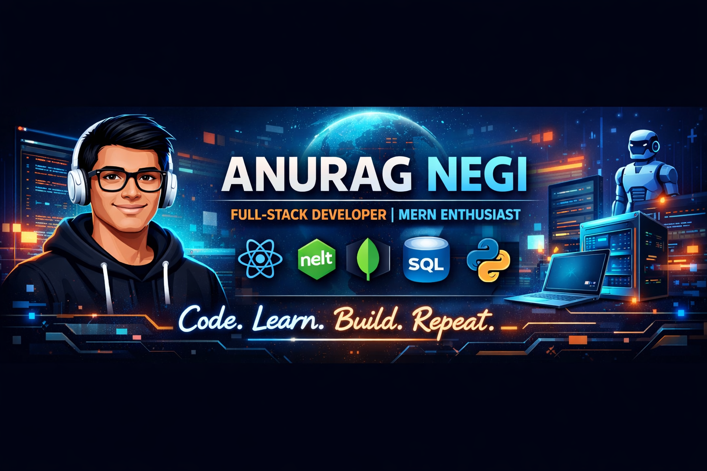

  

# 💫 About Me:
👋 Hi, I’m Anurag Negi 👀 I’m interested in Full Stack web-development(MERN). 🌱 I’m proficient in HTML, CSS, JavaScript, Python, C++ and have knowledge of NodeJS, mongodb etc.. 💞️ I’m looking for experience and contribution in real world projects.

# 💻 Tech Stack:
    
# 📊 GitHub Stats:
 
 

---

<!-- Proudly created with GPRM ( https://gprm.itsvg.in ) -->
